

This tutorial ... [Scottish Remote Sensing Portal](https://remotesensingdata.gov.scot/).

# Step 1 - Download Data

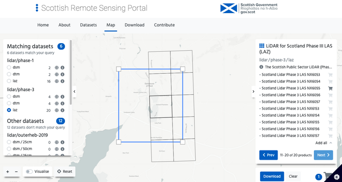

# Step 2

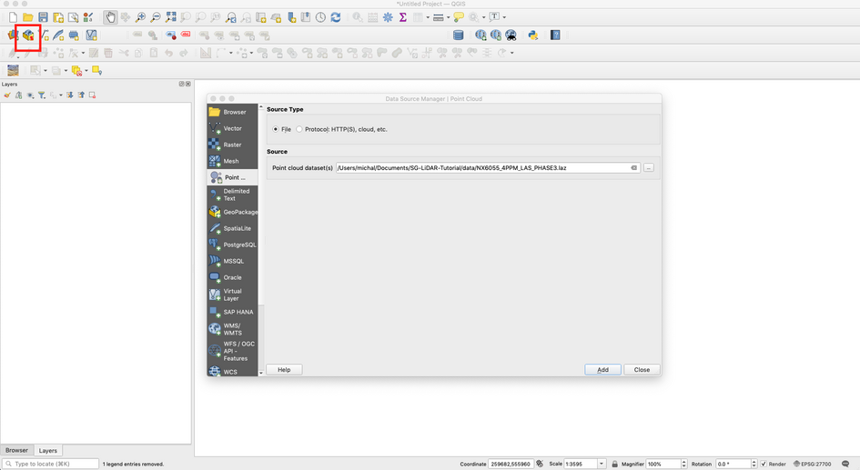

# Step 3

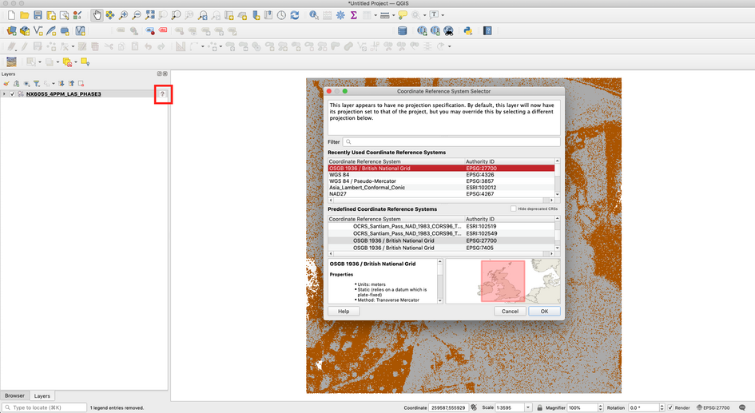

# Step 4

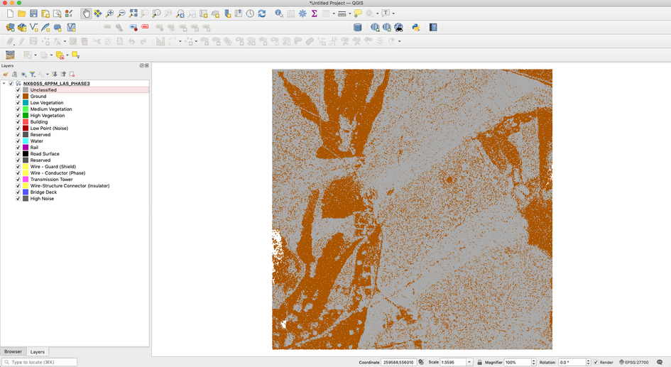

# Step 5

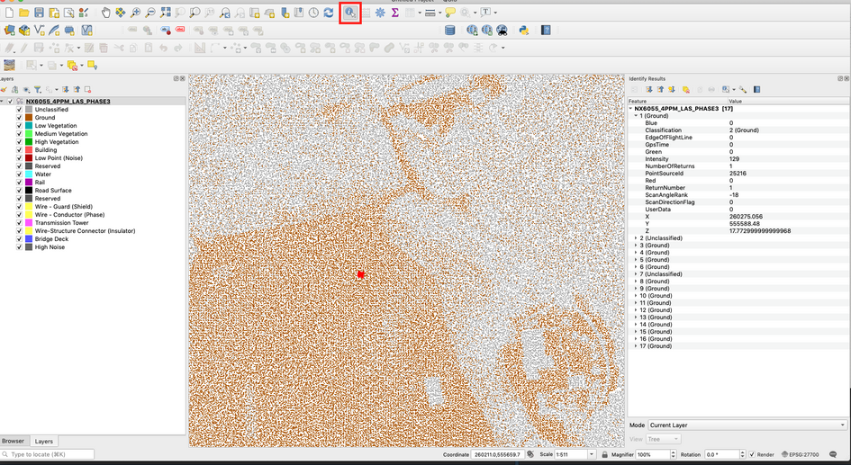

# Step 6

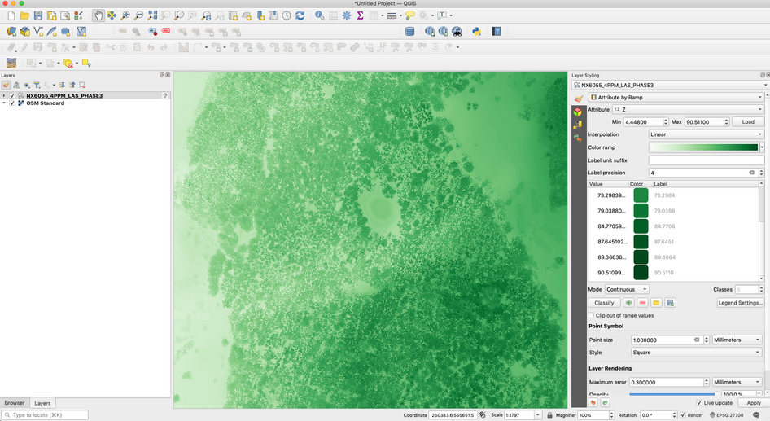

# Step 7

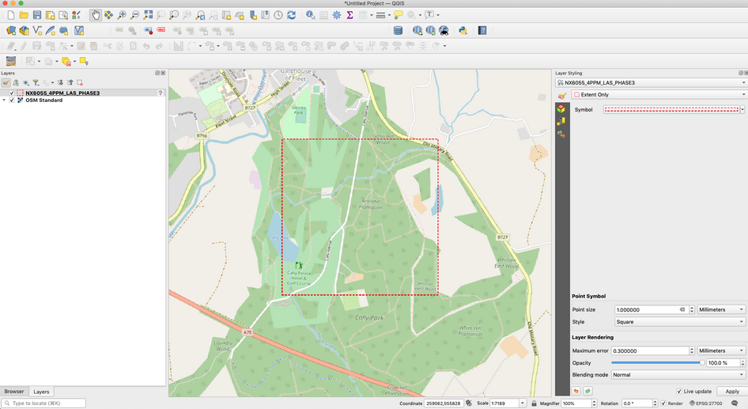

# Step 8

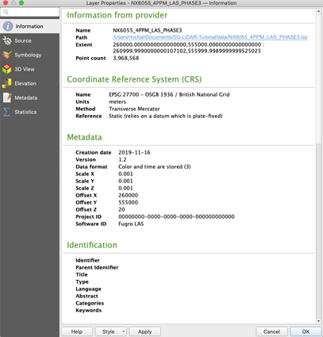

# Step 9

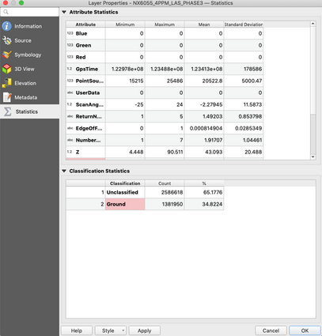

# Step 10

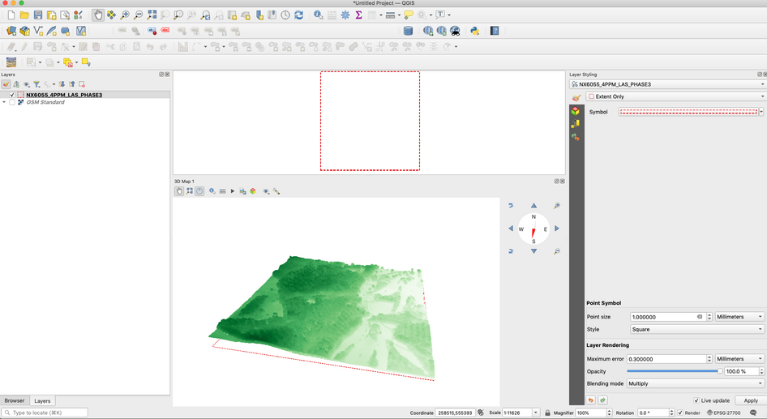

# Step 11

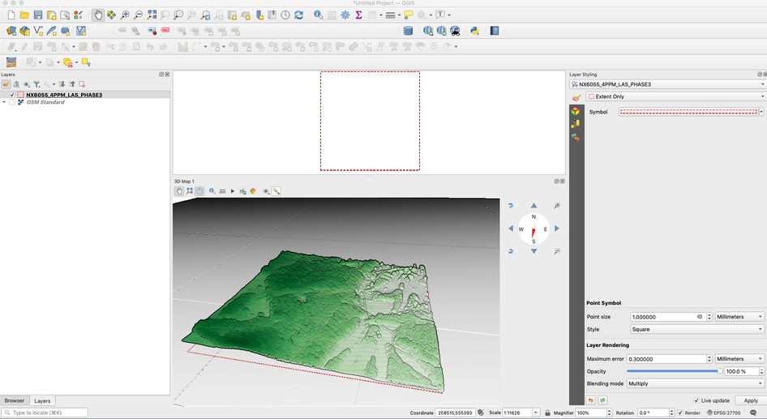

# Step 12

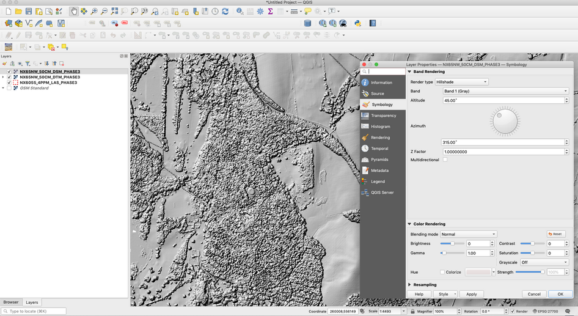

&nbsp;

Geographic Information Science and Analysis Team

<em>GI-SAT@gov.scot</em>

